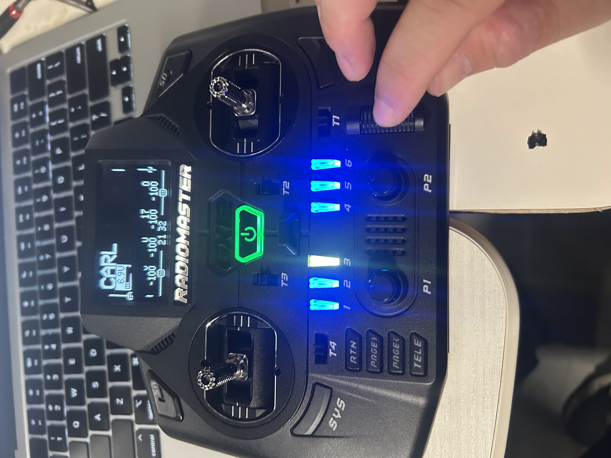
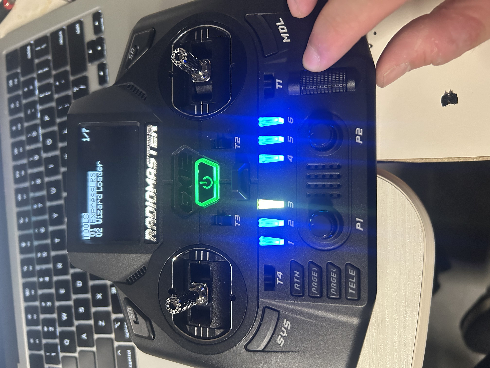
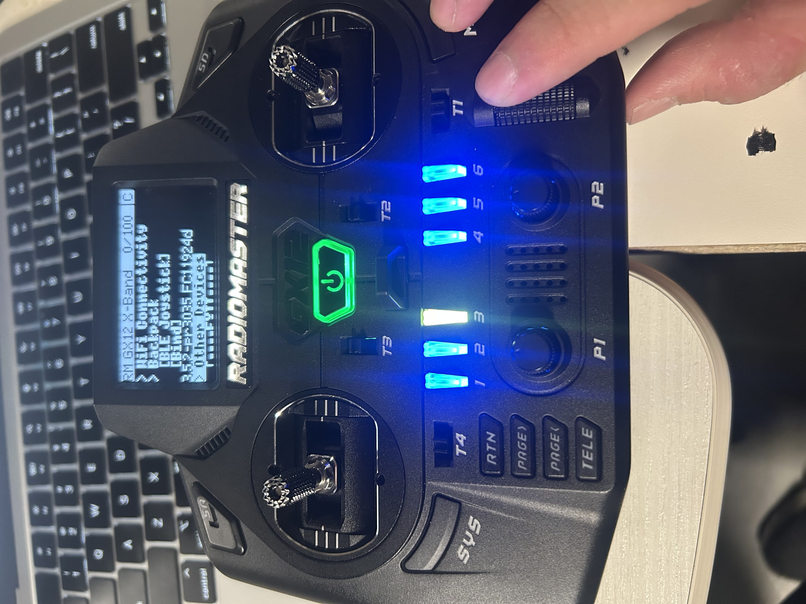
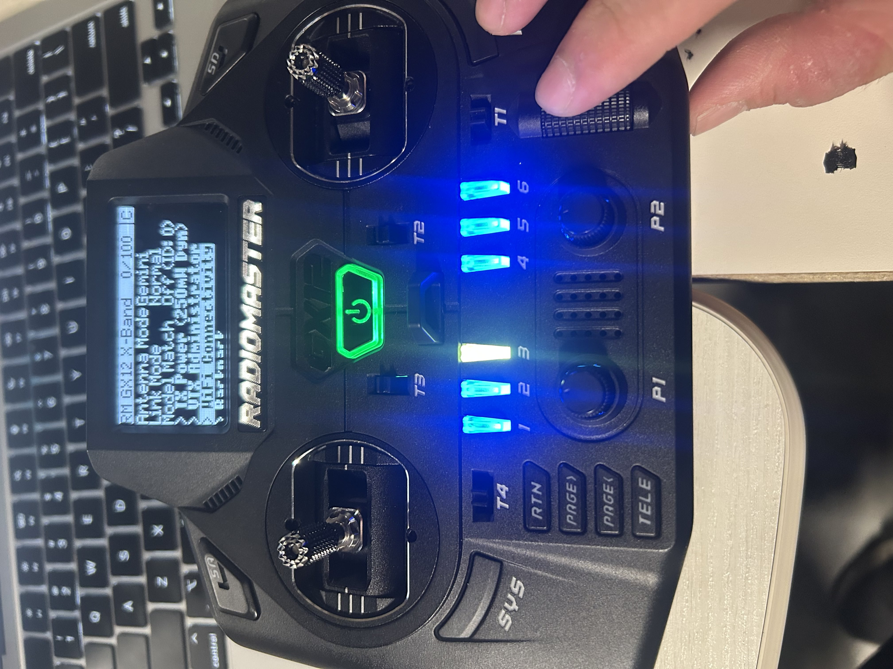
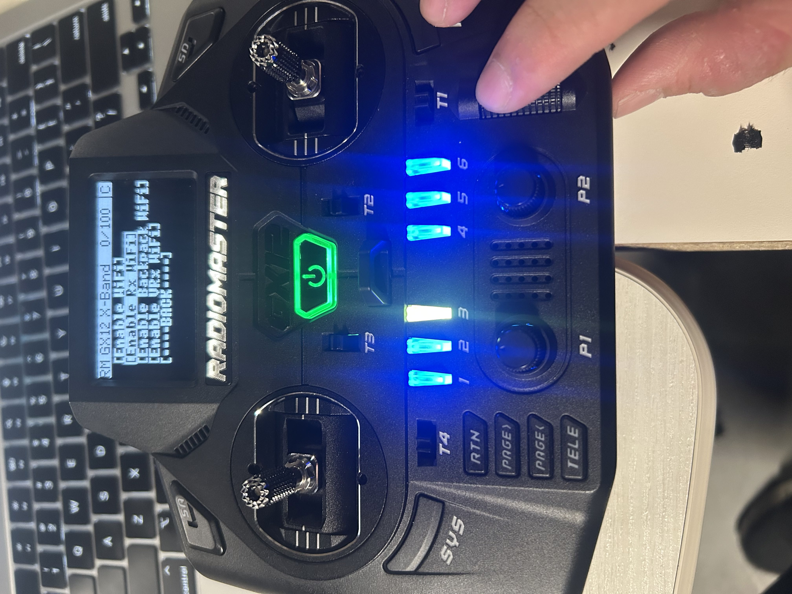
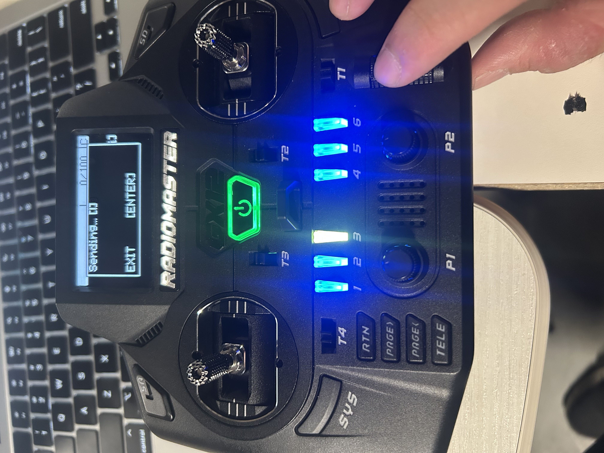
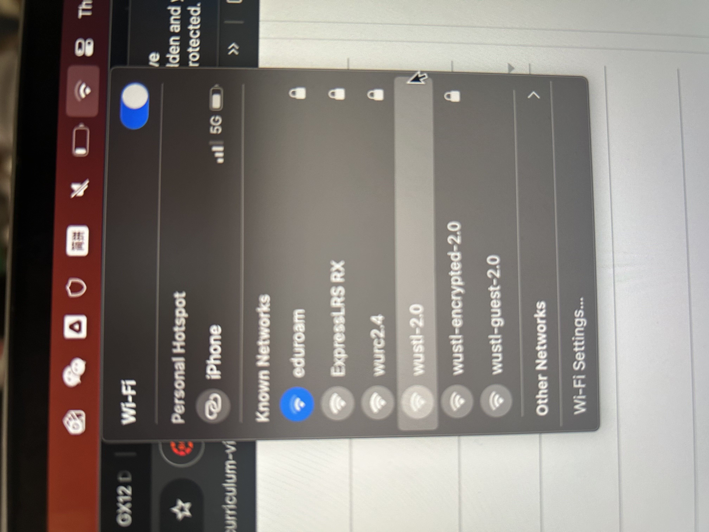

# fan-drone-software


## how to set up the software

1. Clone this repo using Github Desktop or Git. 
2. Install VSCode and Arduino IDE. 
3. Open VSCode, and install an extension called "PlatformIO"
4. Once PlatformIO is installed, click on the alien ant logo on the left sidebar and find an option that says "import project". 
5. click on the "import project" option and select this repo. 
6. platform io will try and install dependencies for the first time and it might take some time. 


## How to setup arduino IDE
1. Download arduino IDE 2.x version
2. Also download the drivers for the esp32 boards at: [for windows and mac](https://www.silabs.com/software-and-tools/usb-to-uart-bridge-vcp-drivers?tab=downloads) and [for m1 macs](https://github.com/WCHSoftGroup/ch34xser_macos)
3. Install arduino IDE and open it, it will run a first time setup, let it do its thing. 
4. Go to the board manager (second icon on the left side bar), search for esp32, and install the package by expressif systems (second one in the image). It will take a while. 


5. Go to the top and there should be a dropdown that says "Select Board", find esp32-dev-module in the left hand side, find the port that's called "COM" something on the right. Select that and save. 


6. You are all set.

## structure of the project
1. ```readme.md``` is readme
2. ```platformio.ini``` is the config file for platform io, it contains the information for which board to use and whatnot. We will be using the esp32-s3-devkitm-1 board. 
3. put your actual code files into ```/src```. 

## buiding and running code
1. connect the board to the laptop
2. press ```ctrl + alt + b``` to build, a terminal window will pop up. 
3. to upload, open the platform io sidebar, and click "upload". 
4. to monitor, open the platform io sidebar and click "monitor".


written by carl sept 20 2025. 


## how to esp-now
esp-now is a way to talk between two esp32s. 

the ```findmac.cpp``` file contains code that is used to find the mac address of both esp32s. They must be found before running ```espnow.cpp```. 

After both mac addresses are found, then go to ```espnow.cpp``` and set the two mac addresses to:

```

uint8_t peerAddress[] = {0x98, 0x88, 0xE0, 0x14, 0xD6, 0xF0}; // <-- change this for each board

```

Since both boards run the same file, you need to set the mac address to the receiver and then flash one board and then set it to sender and then flash the second board. 

Then flash both boards with the same code but with different peer address. They shouhld be able to talk to each other. **Just remember to comment out main.cpp and findmac.cpp** so its the only file running. 

oct 22 by carl


## updated esp-now nov 1
Now esp-now works as designed on two tested esp32 boards. 

Here's what i did for this week: 
1. added a file called ```receiver.cpp``` that functions solely as the receiver. all it does is receive stuff from the sender and sends a "message recevied" reply. 

2. modified ```main.cpp``` to be the latest main branch code + esp now sender code. The code in ```main``` will now try to send over data when it gets it in the CORE 1 loop. Through the ```sendMessage()``` function. 

These two should work, but i havent tested them yet. 

Carl


## receiver/controller wifi setup nov 6
To pair the radiomaster controller to the receiver. do the follwoing. 

1. Wire the receiver up and make sure its powered on, there is a LED on the receiver that lights up. It should flash/pulse and then stay purple. 

2. Fire up the controller. You'll be met with something like this:




3. Then, find the sys button on the right and press it. It should bring you to this menu: 



4. Move your finger to the cylindrical looking wheel and click at the "ExpressLRS" option. 



5. Then use the wheel to scroll down till when you see the option "OTHER DEVICES", this means the receiver is sucessfully paired. You could also verify that by looking for the constant purple LED on the receiver.


6. Then, scroll back up till you see "WIFI CONNECTIVITY" or something similar. 



7. Then use the cylindrical scroll wheel and click on it, it should bring you to this menu: 



8. Then scroll down to "Enable RX WIFI" and click on it, its gonna send start the WIFI on the receiver. 



9. Then navigate to your laptop and find the wifi name "ExpressLRS RX", the password is "expresslrs"



10. Connect to said wifi and go to 10.0.0.1 and there's your setup. 

carl
written by carl sept 20 2025.

## Notes Oct 11 Build and Troubleshooting
- Got the sensor hooked up and working

### How to setup  MPU9250 and laptop
1. Hook up the wires using this image as a reference. Use 8 as clock and 9 as the other one.  


2. Clone the repo and head to the ekf branch Richard created. 

3. Open the project in Platform IO, then import. 

4. Use the alien ant menu to build, upload. 

### How to read MPU9250 raw values 
1. build and run the project. 

2. Fire up Arduino IDE, find the appropriate board and COM setup. Board should be ESP32-Dev-Module and port should be either COM5 or COM7 depending on your computer. 

3. Open serial monitor, set baud rate at 115200 and data should start showing up

4. Then open serial plotter, if values dont show, go to "Tools" > "Serial Plotter", values should start showing up soon. 

Richard and Carl Oct 11.

## carl notes oct 16
This probably is quite similar to what we're doing (but answers given was to use a low-pass instead): https://robotics.stackexchange.com/questions/12633/extended-kalman-filter-for-imu


This example illustrates a MEKF example: https://matthewhampsey.github.io/blog/2020/07/18/mekf

This example gives the complete math to implement a EKF for the mpu9250 sensor: https://www.sikhrobotics.com/orientation/ekf/implementation/

This example gives the full math to implement a kalman filter: https://blog.tkjelectronics.dk/2012/09/a-practical-approach-to-kalman-filter-and-how-to-implement-it/

This is the code for the blog link above: https://github.com/TKJElectronics/KalmanFilter

This might be the most use for us: https://github.com/simondlevy/TinyEKF

TinyEKF is a full blown library and it seems to be doing what we want it to do, we just need to declare the model and 
feed the values in. 

This is another similar implementation but inspired by EKF, not exactly an EKF algorithm: https://x-io.co.uk/open-source-imu-and-ahrs-algorithms/

by carl

## Oct 22 Notes

I've collected time measurements on gathering orientation estimates from our MPU 9250. On average, updating registers and estimating orientation takes ~211us which is ideal if we're shooting for a control loop period of less than 1kHz (1000us). Also, since I haven't posted it yet, here is a video visualizing the RPY orientation of our sensor at a moderate sample rate (note its not perfect since its my hand and not a testing rig).

https://github.com/user-attachments/assets/7d2adfda-667f-469d-be9e-9518fe9fe755

Here are some other changes in our flight controller approach:
+ switched to using the MPU library sensor fusion algorithm (mahony filter) as its simpler, just as accurate/fast as our comlementary filter, and more appropriate for a first prototype.
+ designed the structure of our flight controller firmware to run off two cores: one core for control, another for reporting. these cores share a state structure of our flight controller, accessible via semaphore.
+ began outlining a cascaded PID control loop with a gryo-rate based inner loop and gyro-angle based outer loop. perhaps a single PID control loop for yaw as well.

Richard 
