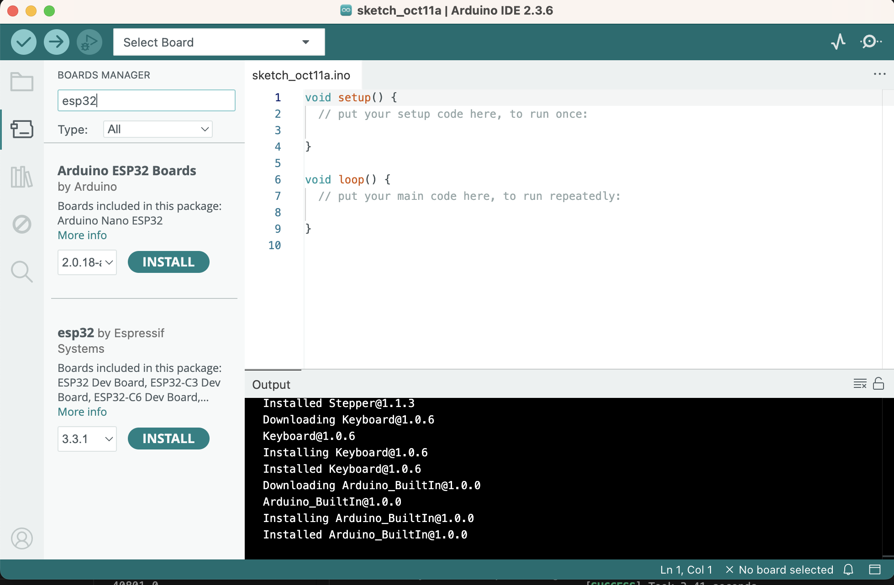
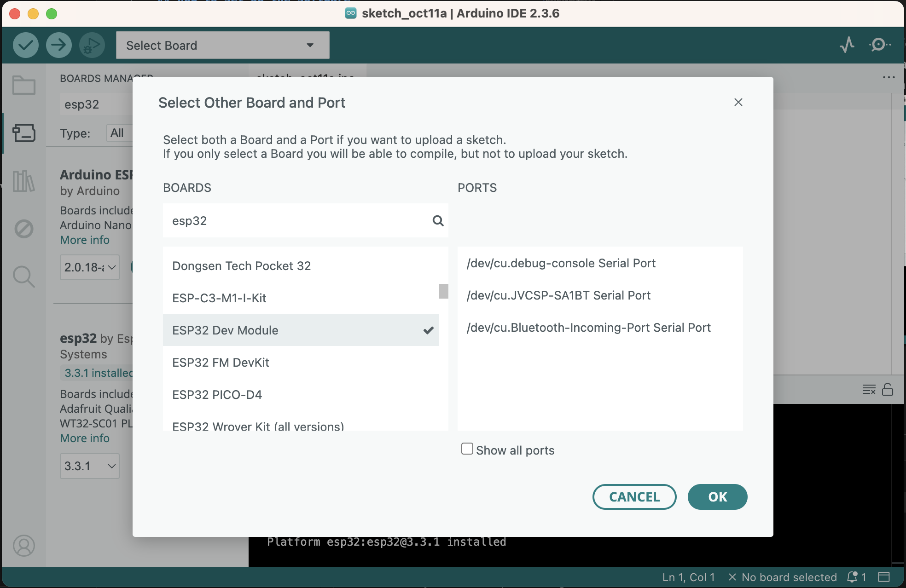
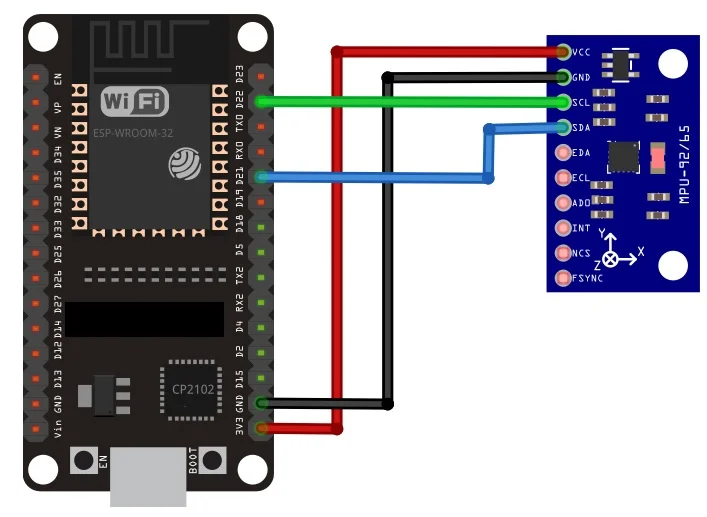

# fan-drone-software


## how to set up the software

1. Clone this repo using Github Desktop or Git. 
2. Install VSCode and Arduino IDE. 
3. Open VSCode, and install an extension called "PlatformIO"
4. Once PlatformIO is installed, click on the alien ant logo on the left sidebar and find an option that says "import project". 
5. click on the "import project" option and select this repo. 
6. platform io will try and install dependencies for the first time and it might take some time. 


## How to setup arduino IDE
1. Download arduino IDE 2.x version
2. Also download the drivers for the esp32 boards at: [for windows and mac](https://www.silabs.com/software-and-tools/usb-to-uart-bridge-vcp-drivers?tab=downloads) and [for m1 macs](https://github.com/WCHSoftGroup/ch34xser_macos)
3. Install arduino IDE and open it, it will run a first time setup, let it do its thing. 
4. Go to the board manager (second icon on the left side bar), search for esp32, and install the package by expressif systems (second one in the image). It will take a while. 


5. Go to the top and there should be a dropdown that says "Select Board", find esp32-dev-module in the left hand side, find the port that's called "COM" something on the right. Select that and save. 


6. You are all set.

## structure of the project
1. ```readme.md``` is readme
2. ```platformio.ini``` is the config file for platform io, it contains the information for which board to use and whatnot. We will be using the esp32-s3-devkitm-1 board. 
3. put your actual code files into ```/src```. 

## buiding and running code
1. connect the board to the laptop
2. press ```ctrl + alt + b``` to build, a terminal window will pop up. 
3. to upload, open the platform io sidebar, and click "upload". 
4. to monitor, open the platform io sidebar and click "monitor".


written by carl sept 20 2025.

# EKF notes

Initialization:
  x₀ = [1, 0, 0, 0, 0, 0, 0]ᵀ
  P₀ = small diagonal matrix
  Q, R = tuned process/measurement noise matrices

For each time step:
  1. Read IMU data (gyro, accel, mag)
  2. PREDICT:
       - compute q_dot = 0.5 * Ω(gyro - bias) * q
       - integrate: q += q_dot * dt
       - normalize q
       - propagate P = F P Fᵀ + Q
  3. UPDATE:
       - normalize accel, mag
       - compute predicted gravity & magnetic field
       - compute residual y = z_meas - z_pred
       - compute H, K, and apply x ← x + K y
       - normalize quaternion
  4. Output current quaternion estimate

also need to tune Q and R parameters. bias might be optional actually.

Written by Richard


## Notes Oct 11 Build and Troubleshooting
- Got the sensor hooked up and working

### How to setup  MPU9250 and laptop
1. Hook up the wires using this image as a reference. Use 8 as clock and 9 as the other one.  



2. Clone the repo and head to the ekf branch Richard created. 

3. Open the project in Platform IO, then import. 

4. Use the alien ant menu to build, upload. 

### How to read MPU9250 raw values 
1. build and run the project. 

2. Fire up Arduino IDE, find the appropriate board and COM setup. Board should be ESP32-Dev-Module and port should be either COM5 or COM7 depending on your computer. 

3. Open serial monitor, set baud rate at 115200 and data should start showing up

4. Then open serial plotter, if values dont show, go to "Tools" > "Serial Plotter", values should start showing up soon. 

Richard and Carl Oct 11.

## Notes Oct 16 Reading raw sensor measurements with noise

### Problems with the raw MPU9250 sensor measurements

So far we are reading raw gyroscopic measurements as the angular rate in RPY directions from our MPU9250 IMU sensor in rad/s.

Below is a video demonstrating these measurements from our sensor at rest, along with added noise (slight vibrations from me tapping around the sensor).

https://github.com/user-attachments/assets/525c6bad-1055-40c2-8811-ee5575128f10

These measurements are not precise or stable enough to reliably be used in the control loops of our flight controller. For example, if we assume a constant angular rate in either of the RPY directions while our sensor is at rest, the error accumulated from such noise will have a significant impact on the flight stability of our monocopter. So, we're going to be implementing an quaternion-based Extended Kalman Filter (EKF) algorithm to minimize noise/disturbance in our sensor accuracy.  

### Quaternion-Based EKF Algorithm

The algorithm will essentially estimate the 3D orientation of our monocopter using the sensor fusion of our MPU9250's gyroscope, accelerometer, and magnetometer. Our algorithm is quaternion-based, meaning the quaternion representing our body frame in reference to our inertial frame will be what estimate's our orientation specifically; this comes with the advantages of avoiding gimbal lock (losing a degree of freedom) and smooth attitude propogation.


## carl notes oct 16
This probably is quite similar to what we're doing (but answers given was to use a low-pass instead): https://robotics.stackexchange.com/questions/12633/extended-kalman-filter-for-imu


This example illustrates a MEKF example: https://matthewhampsey.github.io/blog/2020/07/18/mekf

This example gives the complete math to implement a EKF for the mpu9250 sensor: https://www.sikhrobotics.com/orientation/ekf/implementation/

This example gives the full math to implement a kalman filter: https://blog.tkjelectronics.dk/2012/09/a-practical-approach-to-kalman-filter-and-how-to-implement-it/

This is the code for the blog link above: https://github.com/TKJElectronics/KalmanFilter

This might be the most use for us: https://github.com/simondlevy/TinyEKF

TinyEKF is a full blown library and it seems to be doing what we want it to do, we just need to declare the model and 
feed the values in. 

This is another similar implementation but inspired by EKF, not exactly an EKF algorithm: https://x-io.co.uk/open-source-imu-and-ahrs-algorithms/

by carl
